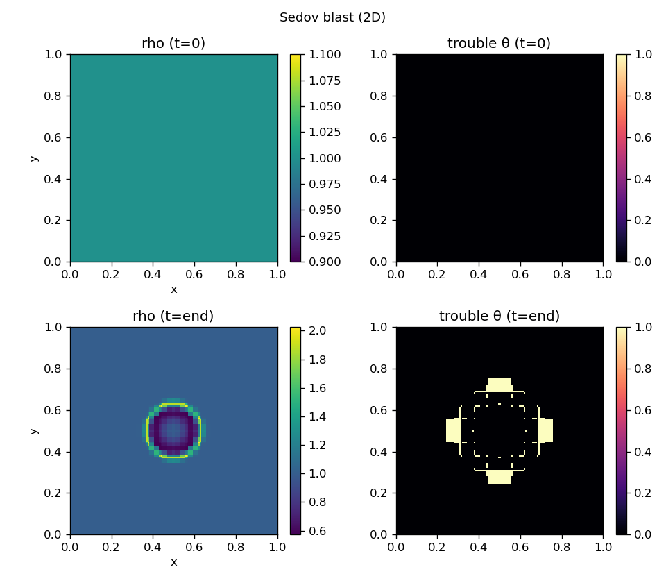
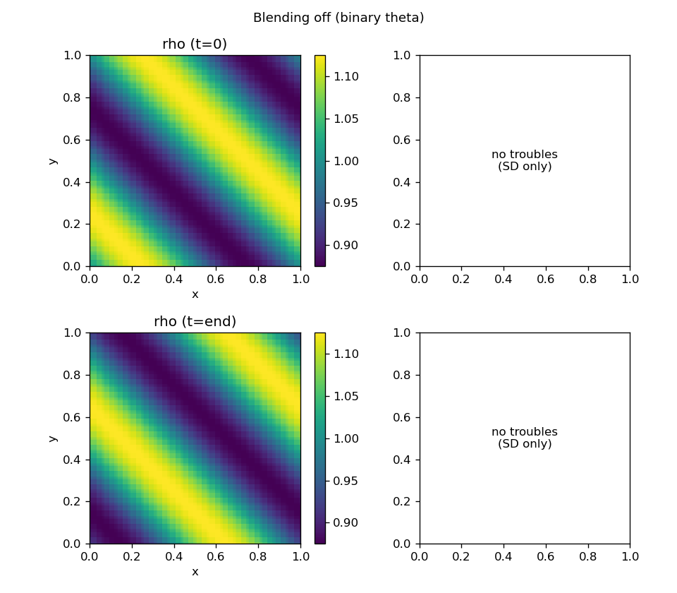
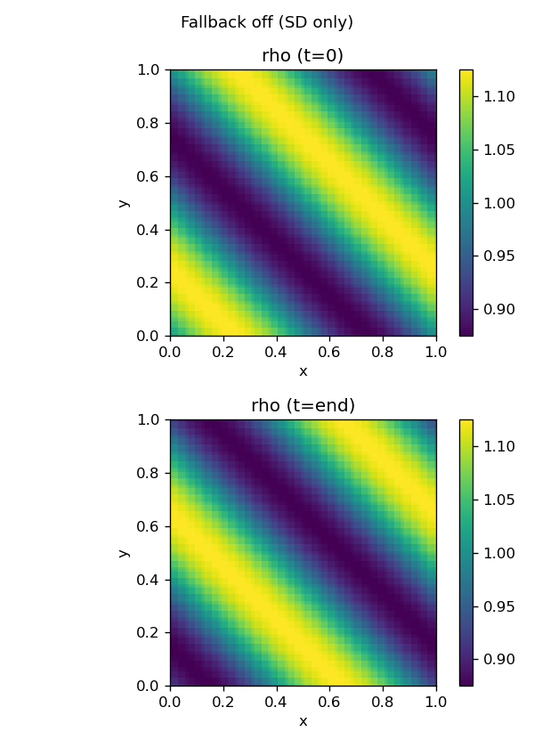

# Finite-volume fallback

When `job/fallback = true` (the default), each step performs:

1. A spectral-difference (SD) flux update on the high-order solution.
2. A finite-volume (FV) representation of the same fields on the Gauss-point
   sub-grid.
3. Trouble detection (NAD ± SED/PAD) on primitive variables.
4. Optional fractional blending of low-order MUSCL–Hancock fluxes in flagged
   cells and their neighborhood.
5. A conservative FV correction that replaces the SD update where θ > 0.

With periodic boundaries the blended flux replacement is **exactly conservative**.
Reflective boundaries mirror ghost data and flip the normal velocity at walls.

## Trouble detection

**NAD** (Numerical Admissibility Detection) flags cell averages that fall
outside a DMP band around the neighborhood extrema. The band width is
`fallback/tolerance`. With `fallback/NAD=delta` the band is scaled by the local
range of the neighborhood rather than `|W|`.

**SED** (Smooth Extrema Detection) relaxes NAD near smooth extrema (active for
`p > 1`).

**PAD** flags negative pressure or density after the predictor.

The Sedov blast below shows the trouble map (right column) tightly tracking the
expanding shock front while the smooth interior stays high-order:

## Blending

When `fallback/blending = true` (default), trouble flags are spread to a
1-cell-wide ring with weights `0.75 / 0.5 / 0.375 / 0.25`, producing a
fractional blend factor θ ∈ [0, 1]. With `blending = false`, θ is binary
(0 or 1).

The trouble-flag map is shown in the {doc}`gallery` panels when fallback is on.

With `blending = false`, θ is binary — flagged cells are fully replaced by the
FV update:

## When to disable fallback

Set `job/fallback = false` for pure SD runs (no FV storage, no trouble detection,
lower memory and faster time steps). Useful for smooth problems like the
advected sine wave at moderate resolution:

