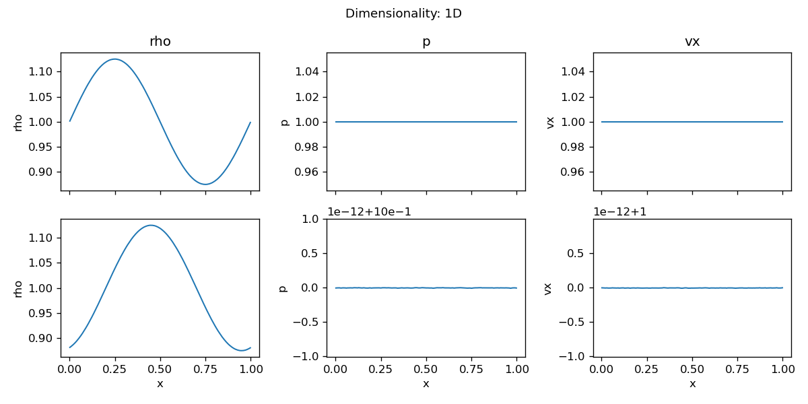
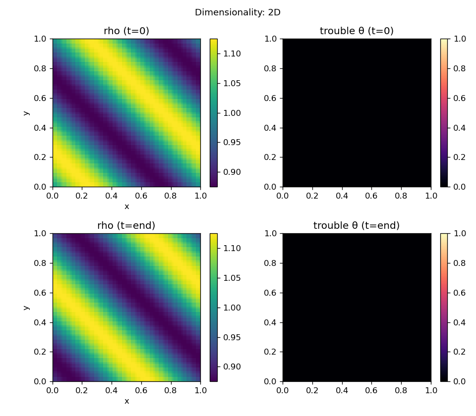
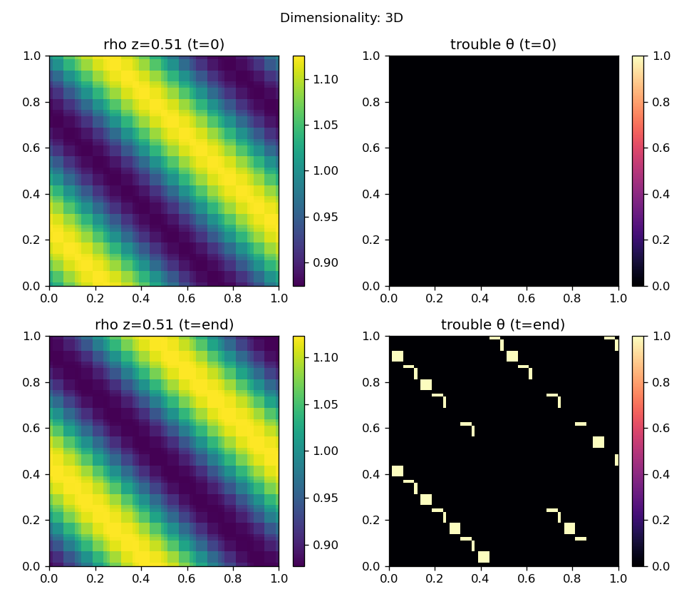

# spd_K visual test gallery

Auto-generated by `tests/visual_suite.py`. Each panel shows the
first and last output snapshot. Reproduce any case with the command
line quoted below the figure.

## Initial conditions

### Sine wave (2D advection)


*Smooth density sine wave advected diagonally; profile is preserved with no visible trouble cells.*

```bash
build/spd_K -i inputs/sine_wave.athinput mesh/nx3=1 mesh/nx1=16 mesh/nx2=16 time/tlim=0.2 output/dt=0.1
```

### Square signal (2D top-hat)


*Top-hat density advected on a periodic box; edges stay sharp with fallback active at the discontinuities.*

```bash
build/spd_K -i inputs/square.athinput
```

### Sod shock tube (1D)


*Sod shock tube: initial jump (top) develops into rarefaction, contact, and shock (bottom).*

```bash
build/spd_K -i inputs/sod.athinput
```

### Shu-Osher (1D)


*Shu-Osher problem: Mach-3 shock interacting with a sinusoidal density field; fine post-shock oscillations are captured.*

```bash
build/spd_K -i inputs/shu_osher.athinput
```

### Kelvin-Helmholtz (2D)


*Kelvin-Helmholtz shear layer rolling up into vortices; trouble map (right) traces the shear interfaces.*

```bash
build/spd_K -i inputs/kelvin_helmholtz.athinput
```

### Liska-Wendroff implosion (2D, reflective)


*Liska-Wendroff implosion with reflective walls; the low-density corner collapses along the diagonal.*

```bash
build/spd_K -i inputs/implosion.athinput time/tlim=0.5 output/dt=0.25
```

### User IC hook (Gaussian pulse)


*User IC hook: Gaussian density pulse advected diagonally, edited in src/user_ic.hpp.*

```bash
build/spd_K -i inputs/user.athinput
```

### Sedov blast (2D)


*Sedov point explosion; an expanding circular blast wave forms with trouble cells on the shock front.*

```bash
build/spd_K -i inputs/sedov.athinput
```

### Spherical blast (2D)


*Over-pressured spherical blast expanding into ambient gas.*

```bash
build/spd_K -i inputs/spherical_blast.athinput
```

## Knobs (sine-wave representative)

### Integrator: ADER


*ADER single-step time integration on the smooth sine wave.*

```bash
build/spd_K -i inputs/sine_wave.athinput mesh/nx1=16 mesh/nx2=16 mesh/nx3=1 time/integrator=ader time/tlim=0.2 output/dt=0.1 job/fallback=true
```

### Integrator: RK3


*SSP-RK3 time integration on the same smooth sine wave for comparison.*

```bash
build/spd_K -i inputs/sine_wave.athinput mesh/nx1=16 mesh/nx2=16 mesh/nx3=1 time/integrator=rk3 time/tlim=0.2 output/dt=0.1 job/fallback=true
```

### Order p=3


*Polynomial order p=3 within each element.*

```bash
build/spd_K -i inputs/sine_wave.athinput mesh/p=3 mesh/nx1=16 mesh/nx2=16 mesh/nx3=1 time/tlim=0.2 output/dt=0.1 job/fallback=true
```

### Order p=7


*Polynomial order p=7 on a coarser mesh (same DOF budget).*

```bash
build/spd_K -i inputs/sine_wave.athinput mesh/p=7 mesh/nx1=8 mesh/nx2=8 mesh/nx3=1 time/tlim=0.2 output/dt=0.1 job/fallback=true
```

### Fallback off (SD only)


*Pure spectral-difference update (fallback disabled): no trouble detection or FV correction.*

```bash
build/spd_K -i inputs/sine_wave.athinput mesh/nx1=16 mesh/nx2=16 mesh/nx3=1 job/fallback=false time/tlim=0.2 output/dt=0.1
```

### Blending off (binary theta)


*Fallback with binary theta (blending off): trouble cells fully replaced by the FV update.*

```bash
build/spd_K -i inputs/sine_wave.athinput mesh/nx1=16 mesh/nx2=16 mesh/nx3=1 fallback/blending=false time/tlim=0.2 output/dt=0.1
```

### NAD: delta band


*NAD trouble band scaled by the local range (delta) instead of the value magnitude.*

```bash
build/spd_K -i inputs/sine_wave.athinput mesh/nx1=16 mesh/nx2=16 mesh/nx3=1 fallback/NAD=delta time/tlim=0.2 output/dt=0.1
```

### Dimensionality: 1D



*1D sine-wave advection.*

```bash
build/spd_K -i inputs/sine_wave.athinput mesh/nx1=32 mesh/nx2=1 mesh/nx3=1 time/tlim=0.2 output/dt=0.1 job/fallback=true
```

### Dimensionality: 2D



*2D sine-wave advection.*

```bash
build/spd_K -i inputs/sine_wave.athinput mesh/nx1=16 mesh/nx2=16 mesh/nx3=1 time/tlim=0.2 output/dt=0.1 job/fallback=true
```

### Dimensionality: 3D



*3D sine-wave advection (mid-z slice shown).*

```bash
build/spd_K -i inputs/sine_wave.athinput mesh/nx1=8 mesh/nx2=8 mesh/nx3=8 time/tlim=0.1 output/dt=0.05 job/fallback=true
```

## Induction

### Magnetic loop (3D induction)


*Kinematic magnetic-loop advection; the field structure is transported across the domain (mid-plane slice).*

```bash
build/spd_K -i inputs/induction_loop.athinput
```
