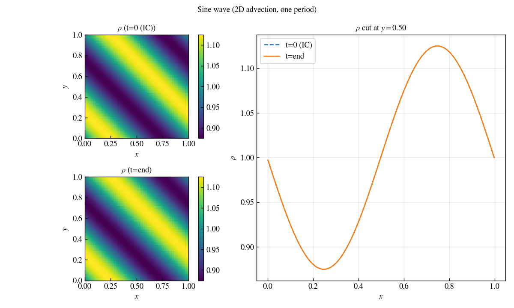
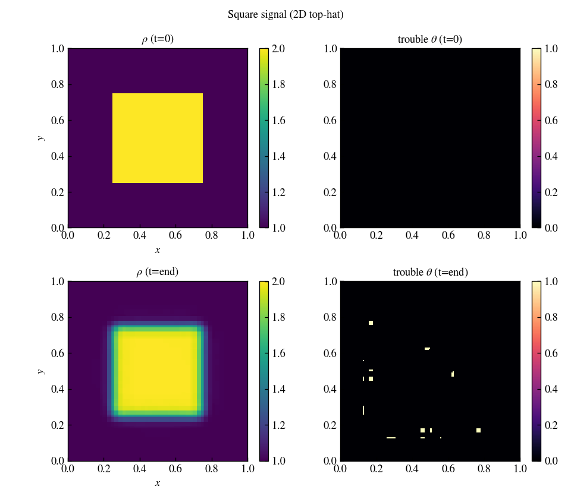
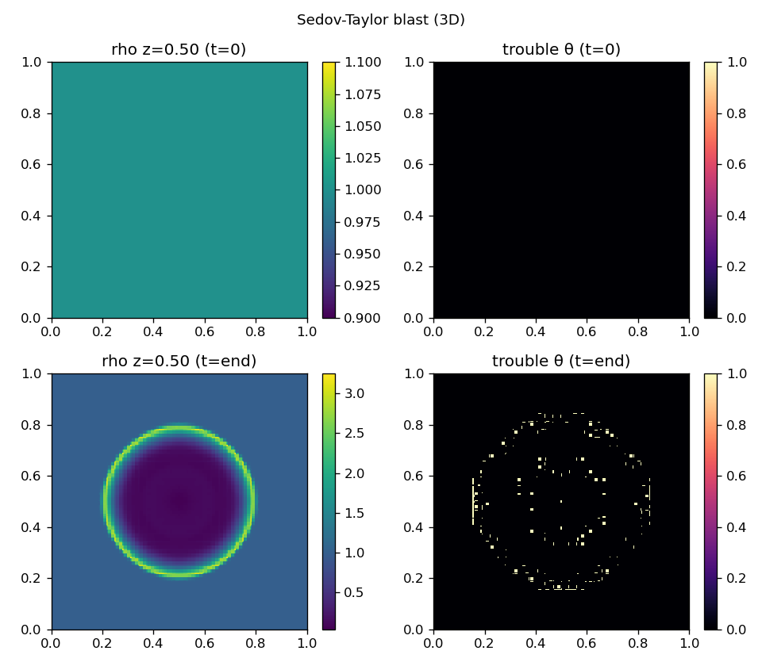
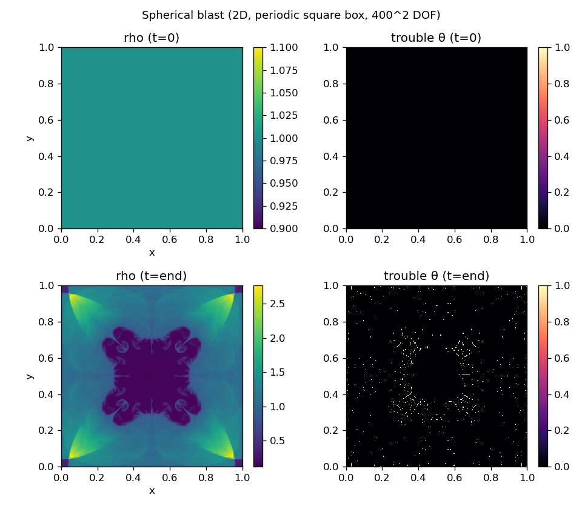
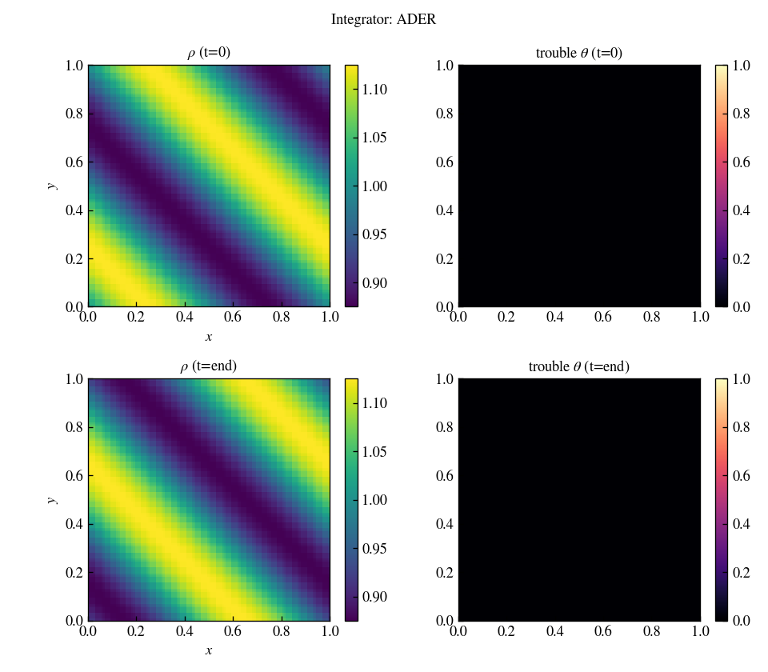
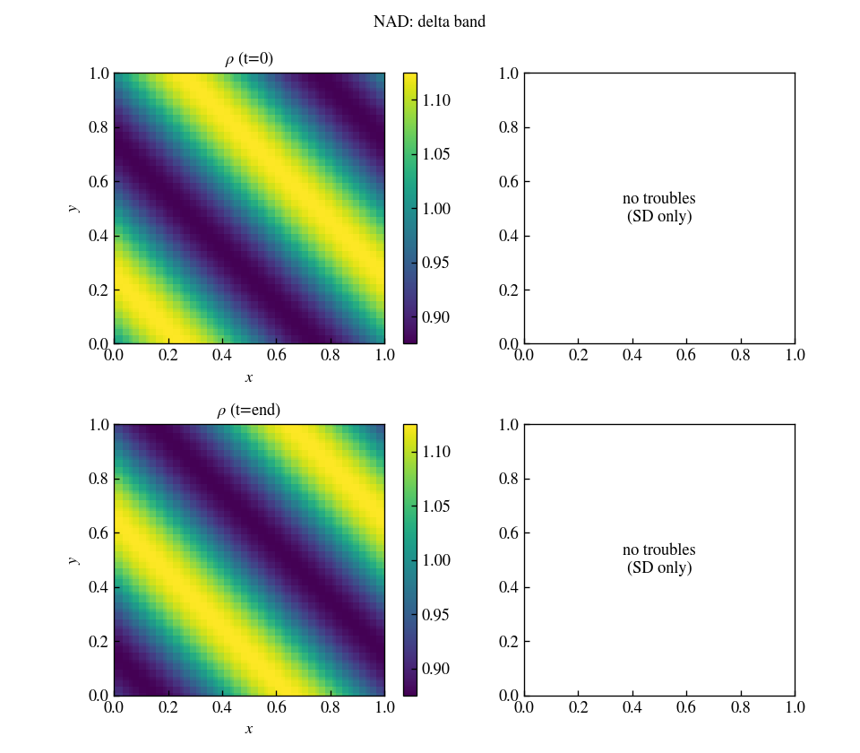
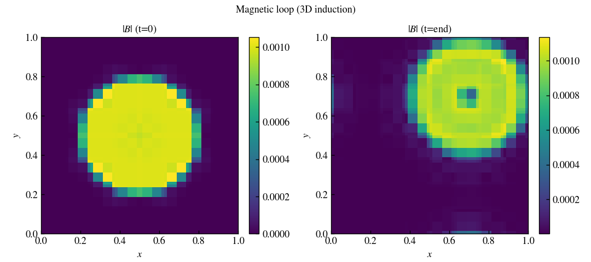

# spd_K visual test gallery

Auto-generated by `tests/visual_suite.py`. Each panel shows the
first and last output snapshot; the command above each figure
reproduces exactly the run that produced it.

## Initial conditions

### Sine wave (2D advection)

```bash
build/spd_K -i inputs/sine_wave.athinput mesh/nx3=1 mesh/nx1=16 mesh/nx2=16 time/tlim=0.2 output/dt=0.1
```



*Smooth density sine wave advected diagonally; profile is preserved with no visible trouble cells.*

### Square signal (2D top-hat)

```bash
build/spd_K -i inputs/square.athinput
```



*Top-hat density advected on a periodic box; edges stay sharp with fallback active at the discontinuities.*

### Sod shock tube (1D)

```bash
build/spd_K -i inputs/sod.athinput
```


*Sod shock tube: initial jump (top) develops into rarefaction, contact, and shock (bottom).*

### Shu-Osher (1D)

```bash
build/spd_K -i inputs/shu_osher.athinput
```


*Shu-Osher problem: Mach-3 shock interacting with a sinusoidal density field; fine post-shock oscillations are captured.*

### Kelvin-Helmholtz (2D)

```bash
build/spd_K -i inputs/kelvin_helmholtz.athinput
```


*Kelvin-Helmholtz shear layer rolling up into vortices; trouble map (right) traces the shear interfaces.*

### Liska-Wendroff implosion (2D, reflective, 400^2 DOF)

```bash
build/spd_K -i inputs/implosion.athinput mesh/nx1=100 mesh/nx2=100 output/dt=2.5
```


*Liska-Wendroff implosion at 400^2 DOF (N=100, p=3) run to t=2.5; the shock collapses onto the corner and a symmetric jet forms along the diagonal between the reflective walls.*

### User IC hook (Gaussian pulse)

```bash
build/spd_K -i inputs/user.athinput
```


*User IC hook: Gaussian density pulse advected diagonally, edited in src/user_ic.hpp.*

### Sedov-Taylor blast (3D)

```bash
build/spd_K -i inputs/sedov.athinput mesh/nx1=32 mesh/nx2=32 mesh/nx3=32 time/tlim=0.5 output/dt=0.5
```



*Sedov-Taylor point explosion in 3D (32^3 elements, mid-z slice); an expanding spherical blast wave forms with trouble cells on the shock front.*

### Spherical blast (2D, periodic square box, 400^2 DOF)

```bash
build/spd_K -i inputs/spherical_blast.athinput mesh/nx1=100 mesh/nx2=100 time/tlim=1.5 output/dt=1.5
```



*Over-pressured blast (p_in/p_out = 100) at 400^2 DOF in a periodic square box, run to t=1.5 so the shock fronts wrap and interact (cf. the Athena blast test).*

## Knobs (sine-wave representative)

### Integrator: ADER

```bash
build/spd_K -i inputs/sine_wave.athinput mesh/nx1=16 mesh/nx2=16 mesh/nx3=1 time/integrator=ader time/tlim=0.2 output/dt=0.1 job/fallback=true
```



*ADER single-step time integration on the smooth sine wave.*

### Integrator: RK3

```bash
build/spd_K -i inputs/sine_wave.athinput mesh/nx1=16 mesh/nx2=16 mesh/nx3=1 time/integrator=rk3 time/tlim=0.2 output/dt=0.1 job/fallback=true
```


*SSP-RK3 time integration on the same smooth sine wave for comparison.*

### Order p=3

```bash
build/spd_K -i inputs/sine_wave.athinput mesh/p=3 mesh/nx1=16 mesh/nx2=16 mesh/nx3=1 time/tlim=0.2 output/dt=0.1 job/fallback=true
```


*Polynomial order p=3 within each element.*

### Order p=7

```bash
build/spd_K -i inputs/sine_wave.athinput mesh/p=7 mesh/nx1=8 mesh/nx2=8 mesh/nx3=1 time/tlim=0.2 output/dt=0.1 job/fallback=true
```


*Polynomial order p=7 on a coarser mesh (same DOF budget).*

### Fallback off (SD only)

```bash
build/spd_K -i inputs/sine_wave.athinput mesh/nx1=16 mesh/nx2=16 mesh/nx3=1 job/fallback=false time/tlim=0.2 output/dt=0.1
```


*Pure spectral-difference update (fallback disabled): no trouble detection or FV correction.*

### Blending off (binary theta)

```bash
build/spd_K -i inputs/sine_wave.athinput mesh/nx1=16 mesh/nx2=16 mesh/nx3=1 fallback/blending=false time/tlim=0.2 output/dt=0.1
```


*Fallback with binary theta (blending off): trouble cells fully replaced by the FV update.*

### NAD: delta band

```bash
build/spd_K -i inputs/sine_wave.athinput mesh/nx1=16 mesh/nx2=16 mesh/nx3=1 fallback/NAD=delta time/tlim=0.2 output/dt=0.1
```



*NAD trouble band scaled by the local range (delta) instead of the value magnitude.*

## Induction

### Magnetic loop (3D induction)

```bash
build/spd_K -i inputs/induction_loop.athinput
```



*Kinematic magnetic-loop advection; the field structure is transported across the domain (mid-plane slice).*
