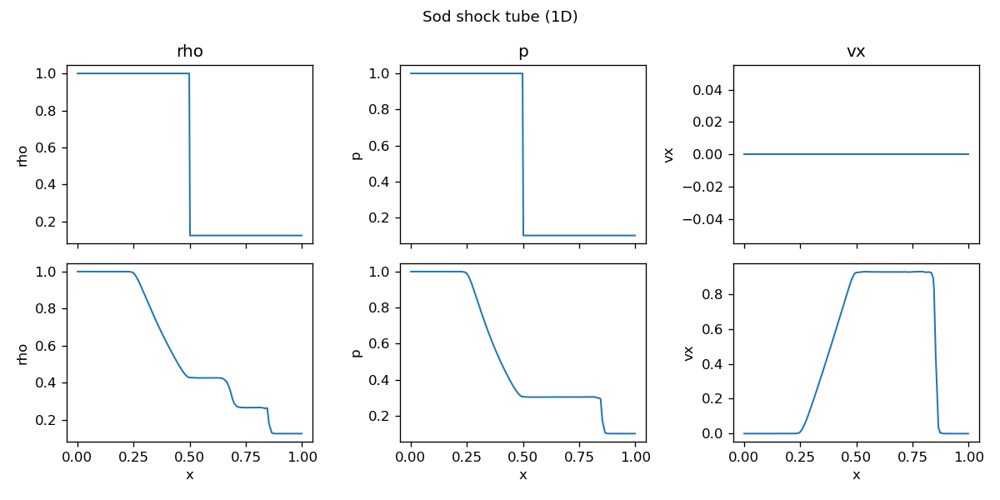
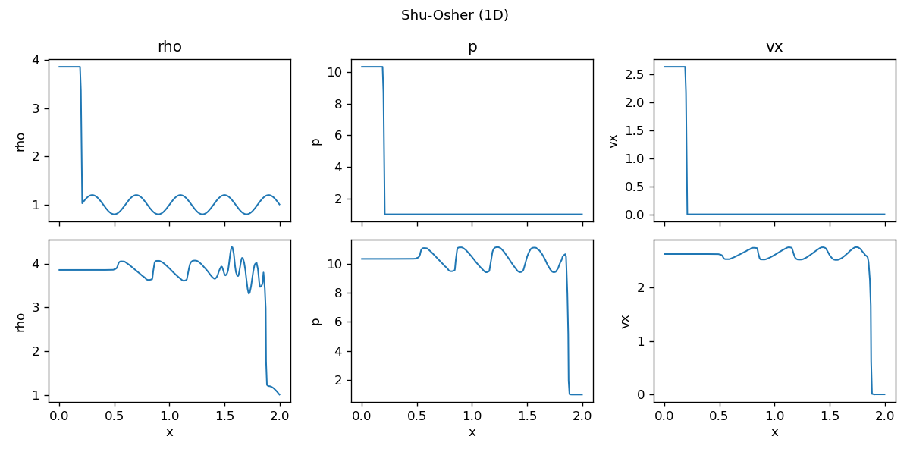
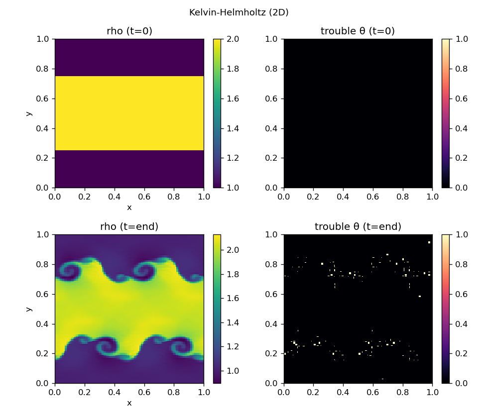
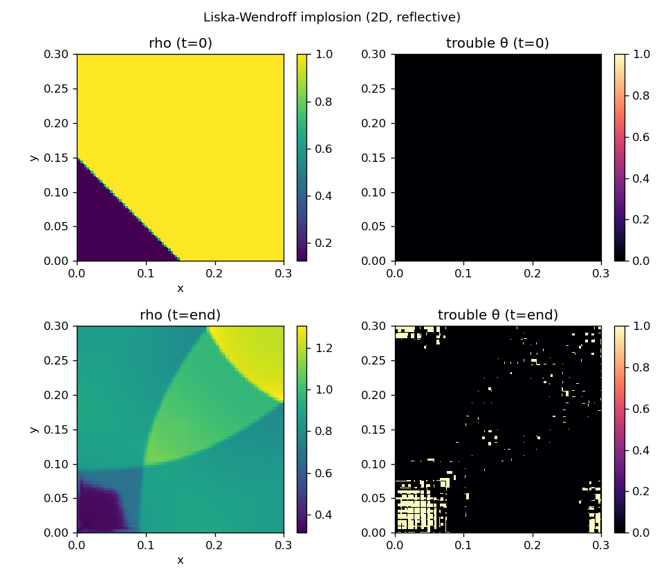

# Initial conditions

Initial conditions are selected with `problem = <name>` in the `<problem>` block.
Each IC returns primitive variables (ρ, velocities, pressure). Parameters below
can tune every built-in IC without recompiling.

## Problem parameters

| Parameter | Meaning (typical use) |
|---|---|
| `amp` | Perturbation amplitude |
| `v1`, `v2`, `v3` | Background / advection velocities |
| `d0`, `d1` | Primary / secondary density |
| `p0`, `p1` | Primary / secondary pressure |
| `radius` | Interface position, feature radius, or pulse center |
| `sigma` | Smoothing or perturbation width |
| `dir` | Direction for 1D profiles: `0` = x, `1` = y, `2` = z |

Defaults are set per problem in `problem_defaults()` (`src/main.cpp`).

## Built-in problems

| `problem` | Input file | Dimensions | BC notes |
|---|---|---|---|
| `sine_wave` | `inputs/sine_wave.athinput` | 1D–3D | periodic |
| `square` | `inputs/square.athinput` | 2D–3D | periodic; top-hat advection |
| `sod_shock_tube` | `inputs/sod.athinput` | 1D–3D | **gradfree** in tube direction |
| `shu_osher` | `inputs/shu_osher.athinput` | 1D | **gradfree** in x; use `x1len=2` |
| `kelvin_helmholtz` | `inputs/kelvin_helmholtz.athinput` | 2D | periodic |
| `implosion` | `inputs/implosion.athinput` | 2D | **reflective**; Liska–Wendroff |
| `sedov` | `inputs/sedov.athinput` | 2D–3D | γ = 5/3 |
| `spherical_blast` | `inputs/spherical_blast.athinput` | 2D–3D | γ = 5/3 |
| `user` | `inputs/user.athinput` | any | see {doc}`user_ic` |

### Sod shock tube

Classic Sod (1978) setup: `(ρ, p) = (d0, p0)` left of `radius`, `(d1, p1)`
right. Gas at rest. Example defaults: `d0=1`, `d1=0.125`, `p0=1`, `p1=0.1`,
`radius=0.5`.

### Shu–Osher

Mach-3 shock interacting with a sinusoidal density wave (Shu & Osher 1989).
Use `x1len=2` so the physical coordinate `x−1` lies in `[-1, 1]`. Parameter
`amp` controls the post-shock sine amplitude (default `0.2`).

### Kelvin–Helmholtz

Double shear layer with sinusoidal `vy` perturbation (same setup as spd's
`KH_instability`). Defaults: `d0=1`, `d1=2`, `v1=0.5`, `amp=0.1`,
`sigma=0.05/√2`, `p0=2.5`.

The right column shows the FV trouble map θ — nonzero only along the rolled-up
shear interfaces where the fallback engages.

### Implosion

Liska & Wendroff (2003) corner implosion: low-density triangle below the
diagonal `x + y = radius` in `[0, 0.3]²`. Requires reflective walls.
Defaults: `radius=0.15`, `d1=0.125`, `p1=0.14`.

## Custom initial conditions

For arbitrary analytic ICs without editing the built-in switch, use
`problem=user` and edit `src/user_ic.hpp` — see {doc}`user_ic`.

## Visual gallery

Snapshot panels for every IC and several knob combinations are in the
{doc}`gallery` (regenerate with `python tests/visual_suite.py`).
