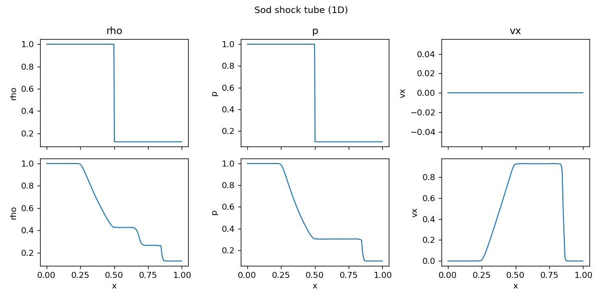
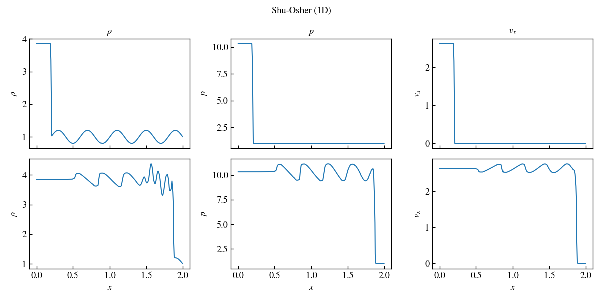
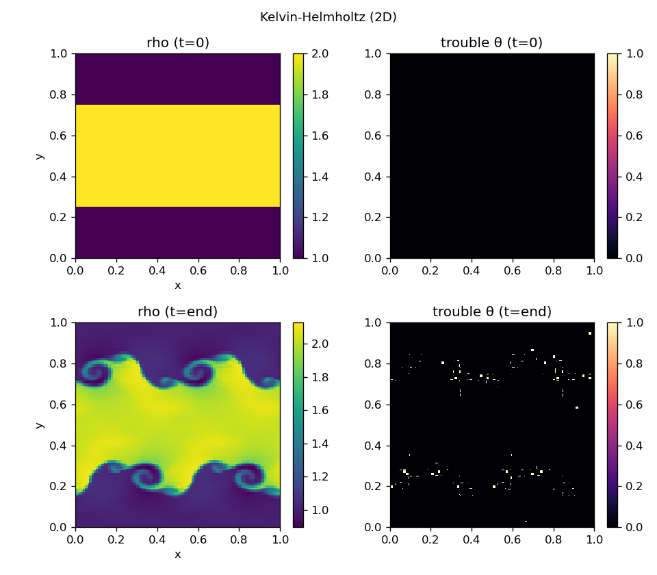
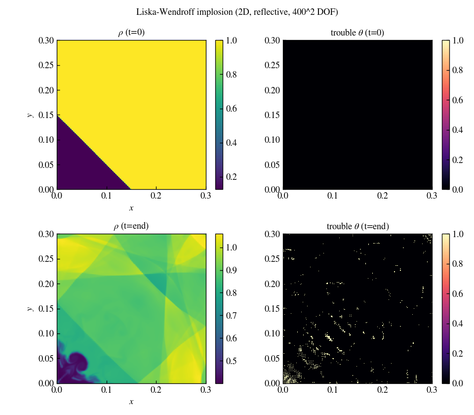
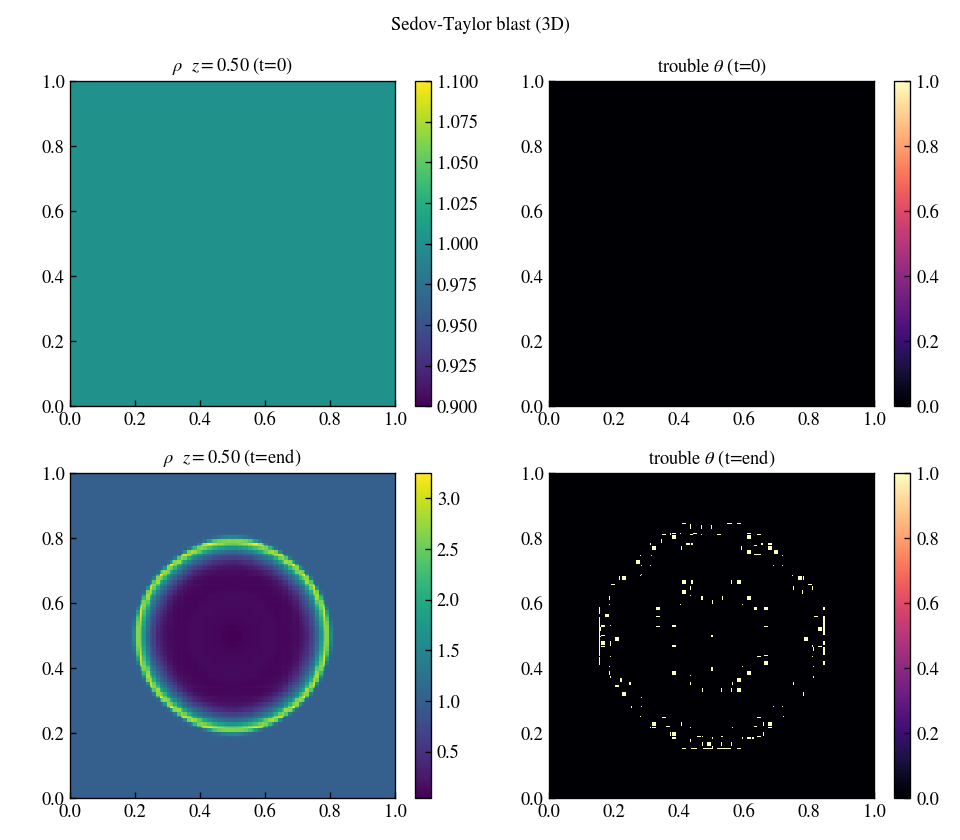
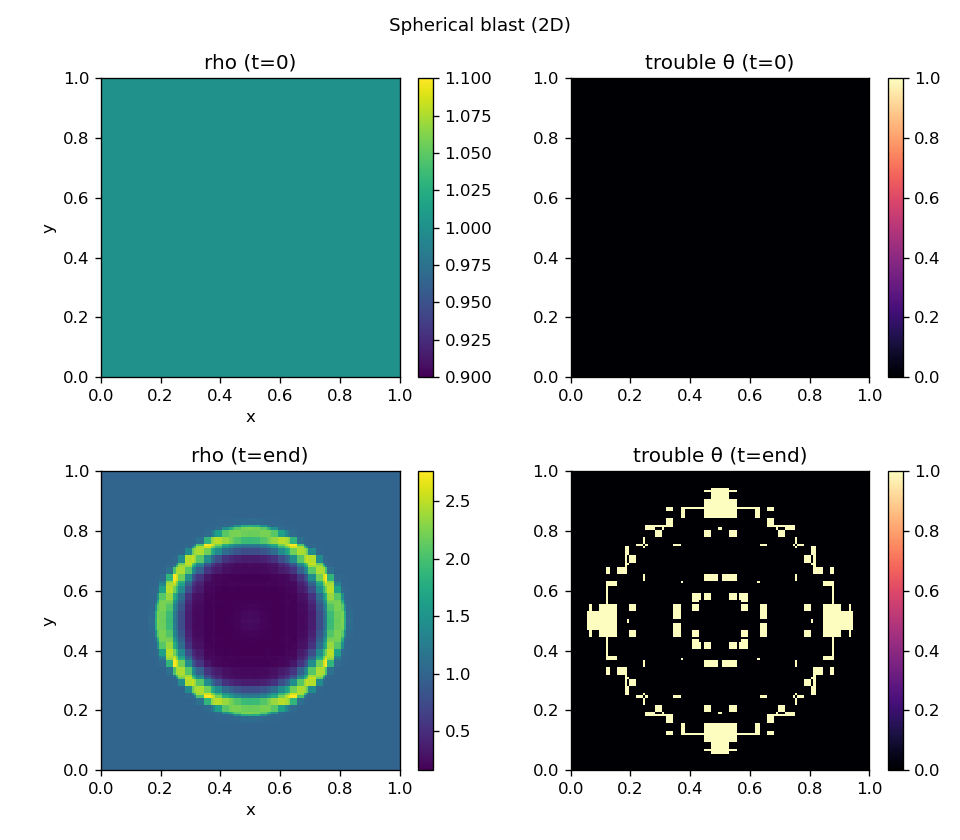
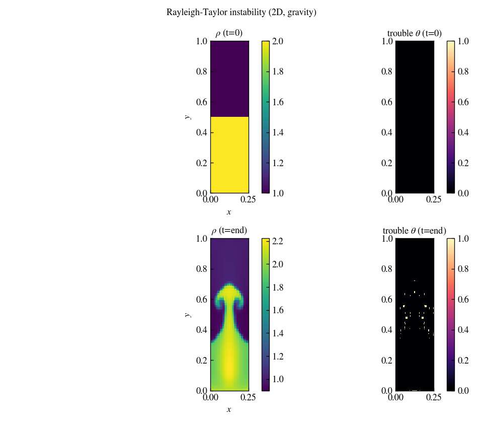

# Initial conditions

Initial conditions are selected with `problem = <name>` in the `<problem>` block.
Each IC returns primitive variables (ρ, velocities, pressure). Parameters below
can tune every built-in IC without recompiling.

## Problem parameters

| Parameter | Meaning (typical use) |
|---|---|
| `amp` | Perturbation amplitude |
| `v1`, `v2`, `v3` | Background / advection velocities |
| `d0`, `d1` | Primary / secondary density |
| `p0`, `p1` | Primary / secondary pressure |
| `radius` | Interface position, feature radius, or pulse center |
| `sigma` | Smoothing or perturbation width |
| `dir` | Direction for 1D profiles: `0` = x, `1` = y, `2` = z |

Defaults are set per problem in `problem_defaults()` (`src/main.cpp`).

## Built-in problems

| `problem` | Input file | Dimensions | BC notes |
|---|---|---|---|
| `sine_wave` | `inputs/sine_wave.athinput` | 1D–3D | periodic |
| `square` | `inputs/square.athinput` | 2D–3D | periodic; top-hat advection |
| `sod_shock_tube` | `inputs/sod.athinput` | 1D–3D | **gradfree** in tube direction |
| `shu_osher` | `inputs/shu_osher.athinput` | 1D | **gradfree** in x; use `x1len=2` |
| `kelvin_helmholtz` | `inputs/kelvin_helmholtz.athinput` | 2D | periodic |
| `implosion` | `inputs/implosion.athinput` | 2D | **reflective**; Liska–Wendroff |
| `sedov` | `inputs/sedov.athinput` | 2D–3D | γ = 5/3 |
| `spherical_blast` | `inputs/spherical_blast.athinput` | 2D–3D | γ = 5/3 |
| `rti` | `inputs/rti.athinput` | 2D | **reflective** in y, periodic in x; needs `hydro/g2` |
| `orszag_tang` | `inputs/orszag_tang.athinput` | quasi-2D (`system=mhd`) | periodic; γ = 5/3; see {doc}`mhd` |
| `field_loop` | `inputs/field_loop.athinput` | quasi-2D (`system=mhd`) | periodic; weak-field loop advection |
| `shock_cloud` | `inputs/shock_cloud.athinput` | 2D–3D | **inflow** on the low x face (the post-shock state), **gradfree** elsewhere; γ = 5/3; `hydro/nscalars=1` |
| `user` | `inputs/user.athinput` | any | see {doc}`user_ic` |

### Sod shock tube

Classic Sod (1978) setup: `(ρ, p) = (d0, p0)` left of `radius`, `(d1, p1)`
right. Gas at rest. Example defaults: `d0=1`, `d1=0.125`, `p0=1`, `p1=0.1`,
`radius=0.5`.

### Shu–Osher

Mach-3 shock interacting with a sinusoidal density wave (Shu & Osher 1989).
Use `x1len=2` so the physical coordinate `x−1` lies in `[-1, 1]`. Parameter
`amp` controls the post-shock sine amplitude (default `0.2`).

### Kelvin–Helmholtz

Double shear layer with sinusoidal `vy` perturbation (same setup as spd's
`KH_instability`). Defaults: `d0=1`, `d1=2`, `v1=0.5`, `amp=0.1`,
`sigma=0.05/√2`, `p0=2.5`.

The right column shows the FV trouble map θ — nonzero only along the rolled-up
shear interfaces where the fallback engages.

### Implosion

Liska & Wendroff (2003) corner implosion: low-density triangle below the
diagonal `x + y = radius` in `[0, 0.3]²`. Requires reflective walls.
Defaults: `radius=0.15`, `d1=0.125`, `p1=0.14`.

### Sedov–Taylor blast

Point explosion: total energy `γ−1` deposited in a sphere of radius `radius`
into cold ambient gas (`γ = 5/3`). Runs in 2D or 3D; the panel below is a 3D
run (`32³` elements), showing the mid-z slice of the expanding spherical shell.

### Shock–cloud interaction

The adiabatic set-up of Pittard & Parkin (2016, MNRAS 457, 4470), after Klein,
McKee & Colella (1994): a planar shock of Mach number `v1` (default 10) runs
along +x through gas at rest (`d0`, `p0`) into a cloud of central density `d1`
(contrast χ = `d1/d0`, default 10) and radius `radius`, centred on
`cx, cy, cz`, in pressure equilibrium with its surroundings. The cloud has the
soft edge of Pittard et al. (2009, eq. 18–19) with steepness `p1` (default 10).
The shock starts `amp` radii upstream of the cloud centre (default 3) with the
Rankine–Hugoniot state behind it. In 2D the cloud is a cylinder. The low x
face prescribes that post-shock state (`mesh/x1_bc=inflow`, `shock_cloud.hpp`):
with the zero-gradient face of the paper the upstream flow drifted by 25% in
three crushing times in 2D and ran away in 3D (ρ 28, p 13 000 against 3.9
and 125 by nine), taking the time step with it.

Cloud material is carried by passive scalar 0 (`hydro/nscalars=1`):
κ = ρ/(χ ρ_amb) within two radii of the centre and zero beyond, the marker the
paper's diagnostics integrate over. `amr/lohner_vars=scalar` makes the mesh
follow it rather than every shock in the box. The deck is the paper's box
(−5 < X < 65, |Y|, |Z| < 10 cloud radii) with one element per cloud radius on
the root mesh. Time is usually quoted from the instant the shock is level with
the cloud centre, in units of the cloud-crushing time
`t_cc = sqrt(χ) radius / v_shock`.

With zero-gradient boundaries the scalar total is conserved only until the
scalar's round-off precursor reaches the upstream face, whose inflow copies
it in (1e-7 of the total at 16 points per radius); in a closed box it is
conserved to round-off through the whole interaction.

### Spherical blast

Over-pressured central region (`p0` inside `radius`, `p1` outside) in uniform
gas at rest (`γ = 5/3`). The blast is centered on the domain, so it also works
in a rectangular box: the panel below uses `p0/p1 = 100` in a periodic
`1 × 1.5` box (`x2len=1.5`) run to late time, where the shock fronts wrap and
interact asymmetrically, reproducing the classic
[Athena blast test](https://www.astro.princeton.edu/~jstone/Athena/tests/blast/blast.html).

### Rayleigh–Taylor instability

Single-mode Rayleigh–Taylor instability, ported from the spd reference. A heavy
layer (`d0=2`) rests below a light layer (`d1=1`) across the interface
`y = radius` (`0.5`), held in hydrostatic balance by a constant vertical
acceleration set through `hydro/g2` (the momentum/energy source term, see
{doc}`gravity`). With the heavy fluid on the low side and `g2 > 0` the layer is
RT-unstable; a `cos(8πx)` velocity perturbation (amplitude `amp`) grows into the
classic rising mushroom plume. Runs in a tall `0.25 × 1` box, periodic in x and
reflective in y (`γ = 5/3`, `t = 1.8`).

## Custom initial conditions

For arbitrary analytic ICs without editing the built-in switch, use
`problem=user` and edit `src/user_ic.hpp` — see {doc}`user_ic`.

## Visual gallery

Snapshot panels for every IC and several knob combinations are in the
{doc}`gallery` (regenerate with `python tests/visual_suite.py`).
