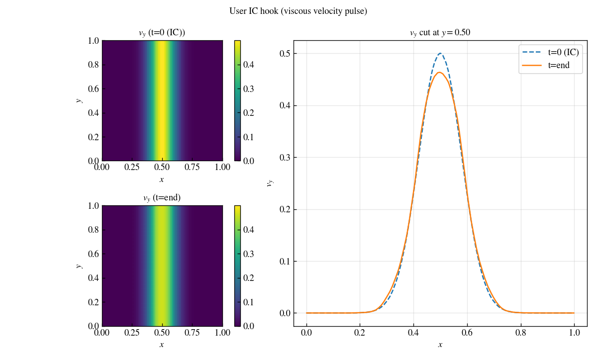

# User-defined initial conditions

Select `problem = user` in the input file (see `inputs/user.athinput`).

## Edit and rebuild

The hook is a single device function in `src/user_ic.hpp`:

```cpp
double user_ic(int var, double x, double y, double z, double gm,
               bool ay, bool az, ProblemParams pp);
```

Return **primitive** variables:

| `var` | Quantity |
|---|---|
| `0` | density ρ |
| `_vx_`, `_vy_`, `_vz_` | velocities |
| `_p_` | pressure |

Inactive directions pass `y = 0` / `z = 0`; `ay` / `az` indicate whether y/z are
active. Point values are integrated with Gauss–Legendre quadrature inside each
element, so discontinuous profiles are allowed.

After editing, rebuild:

```bash
cmake --build build -j
```

## Runtime parameters (no rebuild)

All `<problem>` block fields are available through `pp`:

```bash
./build/spd_K -i inputs/user.athinput problem/amp=0.3 problem/sigma=0.2
```

| Field | Default (user IC) | Role in the sample hook |
|---|---|---|
| `amp` | `0.5` | Pulse amplitude (peak `v_y`) |
| `sigma` | `0.1` | Pulse width |
| `radius` | `0.5` | Pulse center in x |
| `v1` | `1.0` | Advection speed in x |
| `d0` | `1.0` | Background density |
| `p0` | `1.0` | Uniform pressure |

The default hook implements a Gaussian pulse in the **transverse velocity**
`v_y` that varies only in x, carried by a uniform flow `v1`. With uniform
density and pressure this is an exact shear layer that neither compresses nor
generates sound, so it obeys the linear advection–diffusion equation

```
∂v_y/∂t + v1 ∂v_y/∂x = ν ∂²v_y/∂x²
```

With `nu = 0` (the default) the pulse simply advects and returns to its start
at `t = L/v1`. Viscosity is enabled **at runtime** (athenak-style) by setting
`hydro/nu > 0` in the input file — no rebuild needed — after which it spreads as
a Gaussian with `σ²(t) = σ₀² + 2νt`, a clean check of the viscous operator:

```bash
./build/spd_K -i inputs/user.athinput hydro/nu=1e-3
```

The panel below (`hydro/nu=1e-3`) compares the initial condition against the
solution after one advection period: the pulse stays Gaussian while broadening
and losing amplitude.



## Future: `problem=from_file`

Loading ICs from an external binary dump (e.g. generated by a Python script) is
not implemented yet but is the natural extension of this hook.
